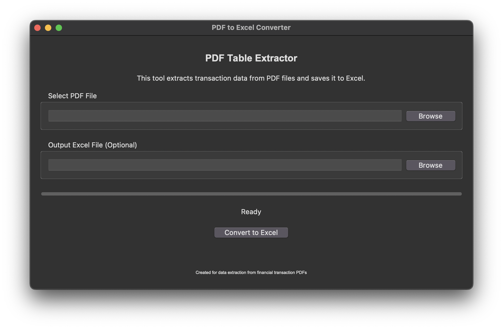

# PDF Table Extractor

A tool for extracting transaction data tables from PDF files and converting them to Excel format with automatic portfolio summary generation.



## Project Structure

````markdown
# PDF Table Extractor

A tool for extracting transaction data tables from PDF files and converting them to Excel format with automatic portfolio summary generation.


## Project Structure

```
PdfTableExtractor/
│
├── images/                     # Folder for screenshots and images
│   └── screenshot.png          # Screenshot of the application
│
├── pdf_table_extractor/        # Main package for PDF Table Extractor
│   ├── __init__.py             # Package initialization file
│   ├── pdf_to_excel_app.py     # Main application script
│   ├── explore_pdf.py          # Script for exploring PDF structure
│   └── extract_transactions_simple.py  # Simple transaction extraction logic
│
├── tests/                      # Unit tests for the application
│   ├── __init__.py             # Package initialization file
│   └── test_pdf_table_extractor.py  # Unit tests for pdf_table_extractor
│
├── .gitignore                  # Git ignore file
├── README.md                   # This README file
└── requirements.txt            # Python package dependencies
```

## Overview

This application was originally designed for extracting financial transaction data from Inventure Broking PDFs, but it can be configured for other similar PDF formats. It extracts tabular data with a focus on transaction details including:

- Script Symbol information
- Company name
- Transaction dates
- Quantities and rates
- Amount values

The tool automatically handles multipage documents, preserves relationships between script symbols and their transactions across pages, and creates clean Excel output ready for analysis.

## Features

- Simple graphical user interface
- Support for complex table structures
- Cleaning and standardization of data (dates, numeric values)
- Automatic portfolio summary generation with:
  - Total position quantities grouped by security
  - GOOGLEFINANCE formulas for current prices
  - Automatic value calculations
- Portfolio XIRR calculation preparation
- Preserves script/security information across pages
- Custom Excel output path
- Works on Windows, macOS, and Linux

## Installation

### Prerequisites

- Python 3.7 or higher
- pip (Python package installer)

### Setup Instructions

#### Clone the Repository

```bash
git clone https://github.com/aayushshah1/PdfTableExtractor.git
cd pdf-table-extractor
```

#### Windows Installation

1. Create and activate a virtual environment:
```
python -m venv venv
venv\Scripts\activate
```

2. Install required packages:
```
pip install -r requirements.txt
```

3. Run the application:
```
python pdf_to_excel_app.py
```
Or double-click on `run_app.bat` in the File Explorer.

#### macOS/Linux Installation

1. Create and activate a virtual environment:
```bash
python3 -m venv venv
source venv/bin/activate
```

2. Install required packages:
```bash
pip install -r requirements.txt
```

3. Make the run script executable:
```bash
chmod +x run_app.command
```

4. Run the application:
```bash
./run_app.command
```
Or double-click on `run_app.command` in Finder (macOS).

## Usage

1. Launch the application using the method appropriate for your operating system.
2. Click "Browse" to select your PDF file.
3. Optionally specify a custom output location for the Excel file.
4. Click "Convert to Excel" to begin the extraction process.
5. When complete, you can choose to open the Excel file immediately.

## Customization

If you need to adapt this tool for other PDF formats:

1. Examine your PDF structure using the `explore_pdf.py` script:
```
python explore_pdf.py path/to/your/file.pdf
```

2. Based on the output, you may need to modify the `extract_transactions_simple.py` script to adjust:
   - Column detection logic
   - Row filtering criteria
   - Data cleaning procedures

## Troubleshooting

**No tables found in PDF**
- Ensure the PDF contains actual tables and not images of tables
- Try running the `explore_pdf.py` script to see what tables are detected

**Missing or incorrect data**
- Some PDFs use complex layouts that may require customization
- Check if the PDF has security restrictions that prevent extraction

**Application crashes**
- Ensure all dependencies are correctly installed
- Check the console/terminal for error messages

## Acknowledgments

- Built with pdfplumber for table extraction
- Developed for extracting financial transaction data from broker statements
- Special thanks to the open-source community for the excellent libraries that made this tool possible
````
